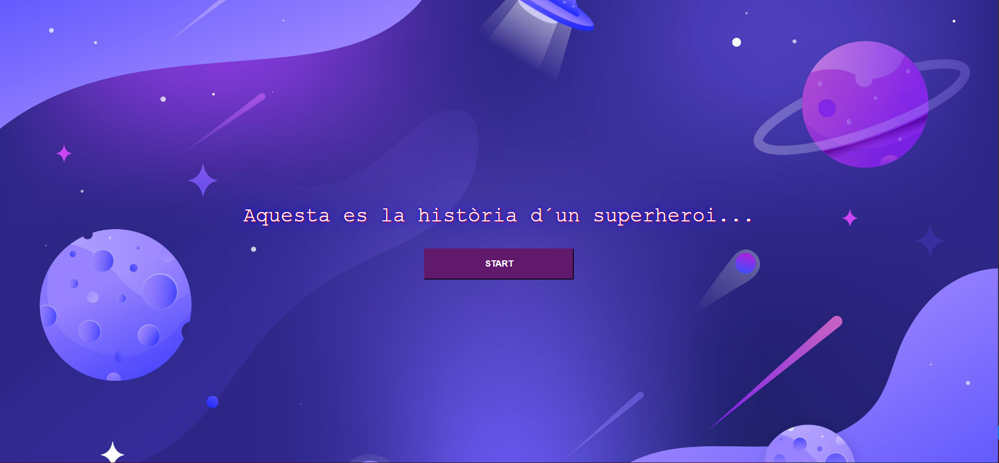
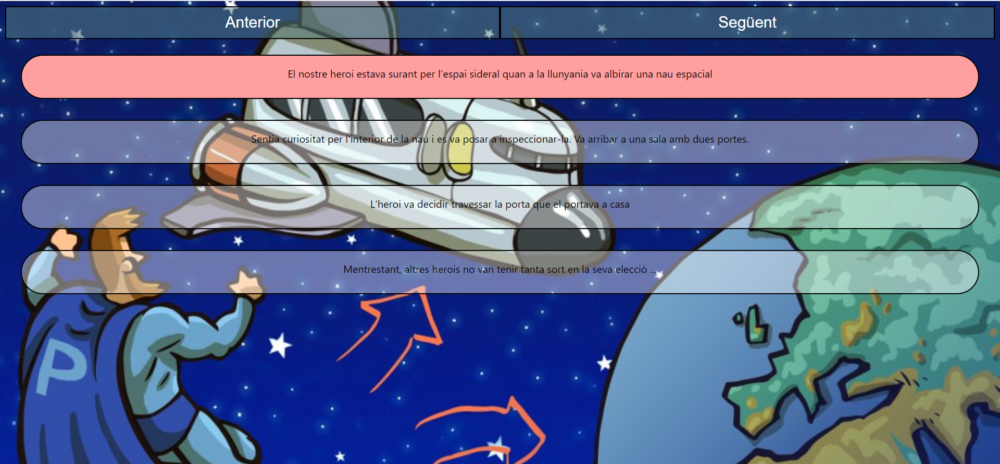

# HERO APP

A client whose main product is a business management website developed with React, has asked us to develop a tutorial, in wich, using two buttons, new user can move forward and backward in the tips, modifying the help text and background image.

This project was bootstrapped with [Create React App](https://github.com/facebook/create-react-app).
## Available Scripts
In the project directory, you can run:
### `npm start`

Runs the app in the development mode.\
Open [http://localhost:3000](http://localhost:3000) to view it in your browser.

The page will reload when you make changes.\
You may also see any lint errors in the console.

### `npm test`

Launches the test runner in the interactive watch mode.\
See the section about [running tests](https://facebook.github.io/create-react-app/docs/running-tests) for more information.

### `npm run build`

Builds the app for production to the `build` folder.\
It correctly bundles React in production mode and optimizes the build for the best performance.

### `npm run eject`

**Note: this is a one-way operation. Once you `eject`, you can't go back!**

